# Analysis-aware defeaturing

This repository contains the numerical illustrations published in the following papers (and some more):
- [BCV2022] "Analysis-aware defeaturing: Problem setting and _a posteriori_ estimation"\
    &emsp;&emsp;&emsp;&emsp;&emsp;&nbsp;&nbsp;by Annalisa Buffa, Ondine Chanon and Rafael Vázquez\
    &emsp;&emsp;&emsp;&emsp;&emsp;&nbsp;&nbsp;in _Mathematical Models and Methods in Applied Sciences_, 32(02), 359-402 (2022).\
    &emsp;&emsp;&emsp;&emsp;&emsp;&nbsp;&nbsp;Journal article: [https://doi.org/10.1142/S0218202522500099/](https://doi.org/10.1142/S0218202522500099/)\
        &emsp;&emsp;&emsp;&emsp;&emsp;&nbsp;&nbsp;arXiv (Open Access): [https://doi.org/10.48550/arXiv.2007.11525/](
https://doi.org/10.48550/arXiv.2007.11525/)

Libraries needed to run the examples:
  - NURBS package: [https://octave.sourceforge.io/nurbs/](https://gnu-octave.github.io/packages/nurbs/)
  - GeoPDEs 3.2.2: [http://rafavzqz.github.io/geopdes/](http://rafavzqz.github.io/geopdes/)
  

## Tests and considered geometries:

### **test01**: 
* 1 positive feature, 2D

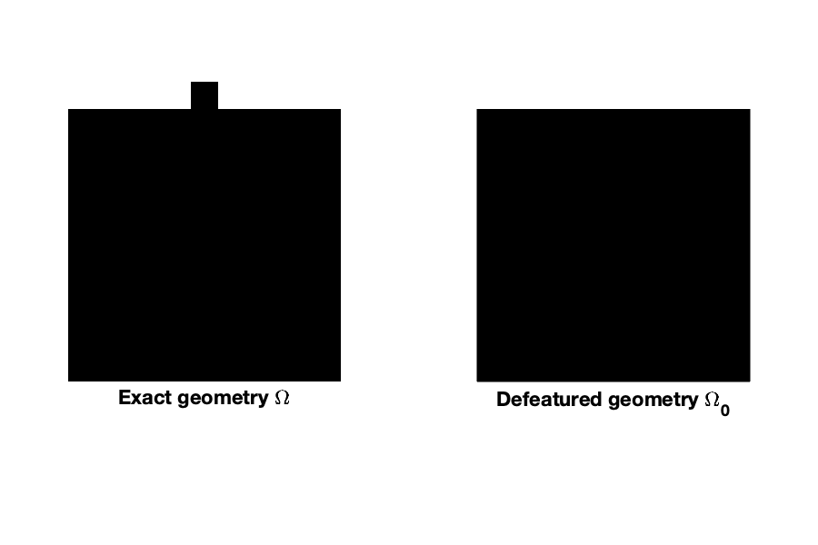

### **test02**: 
* 1 positive feature, 2D\
* [BCV2022], Section 6.2.1 where $\Omega = \Omega^4_\varepsilon$

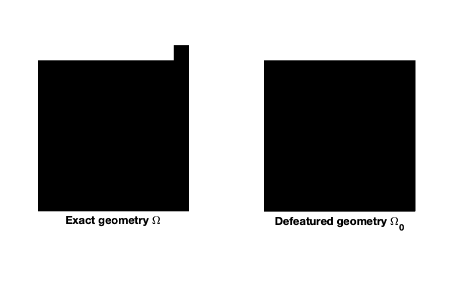

### **test04**: 
* 1 negative feature, 2D

### **test05**:
* 1 negative feature, 2D
* [BCV2022], Section 6.2.1 where $\Omega = \Omega^2_\varepsilon$

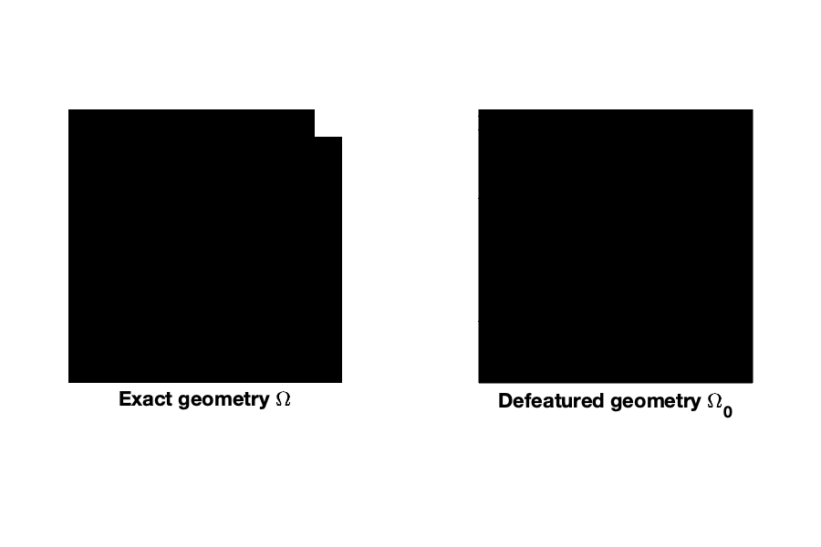

### **test06**:
* 1 negative feature and 1 positive feature, 2D
* [BCV2022], Section 6.2.1 where $\Omega = \Omega^5_\varepsilon$

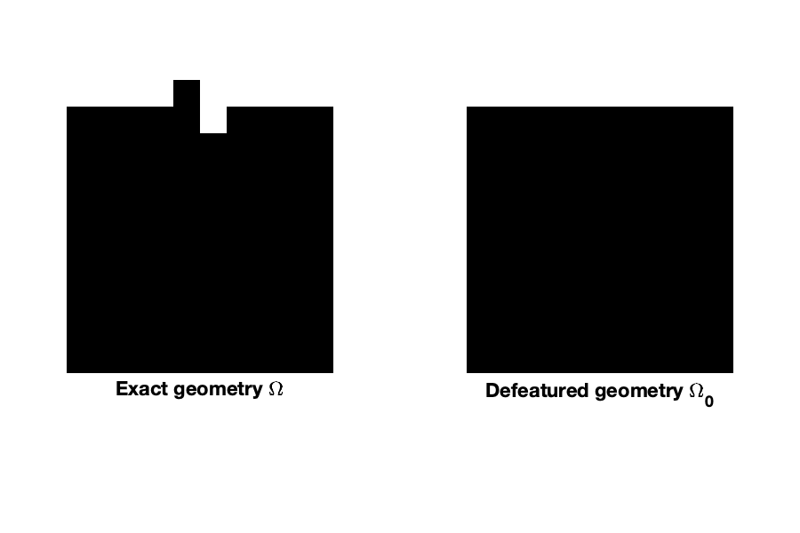

### **test07**:
* 1 complex feature (with a negative and a positive components), 2D
* [BCV2022], Section 6.2.1 where $\Omega = \Omega^6_\varepsilon$

### **test16**:
* 1 negative feature, 2D
* [BCV2022], Section 6.2.1 where $\Omega = \Omega^1_\varepsilon$

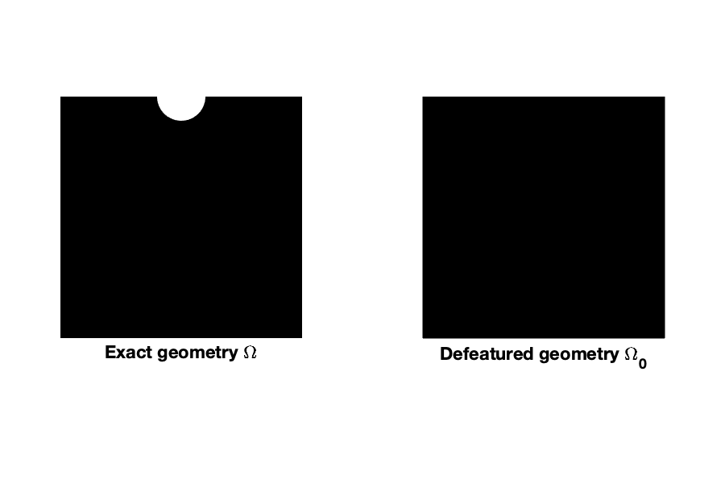

### **test17**:
* 1 negative feature, 2D
* [BCV2022], Section 6.1.1 where $\Omega = \Omega_s$

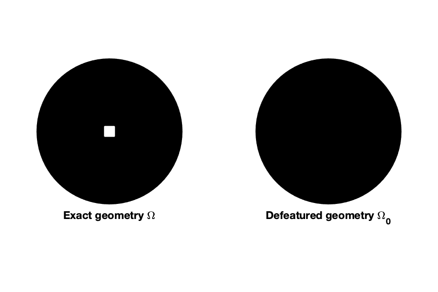

### **test18**: 
* 1 negative feature, 2D
* [BCV2022], Section 6.1.1 where $\Omega = \Omega_c$

### **test19**:
* 1 negative feature, 2D
* [BCV2022] Section 6.1.1 where $\Omega = \Omega_\star$

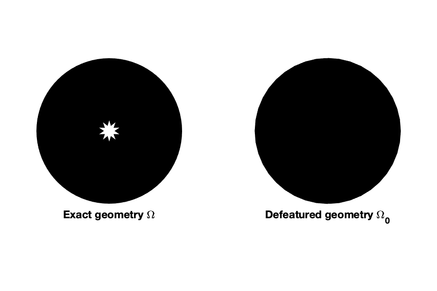

### **test21**: 
* [BCV2022], Section 6.2.1 where $\Omega = \Omega^3_\varepsilon$
* 1 positive feature, 2D

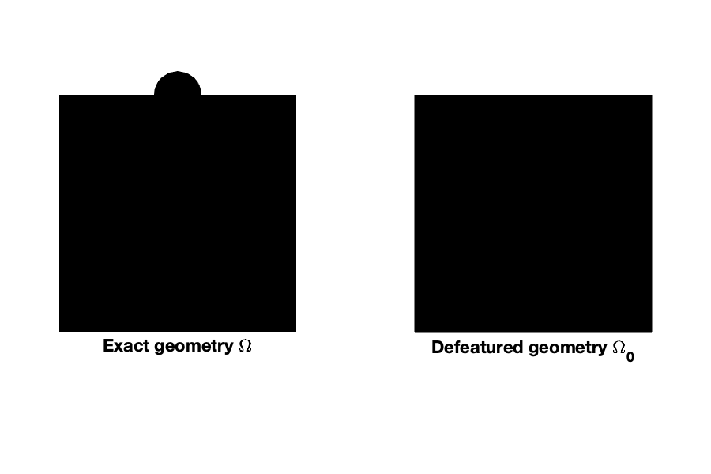

### **test30**: 
* [BCV2022], Section 6.2.2 where $\Omega = \Omega^1_\varepsilon$
* 1 negative feature, 3D

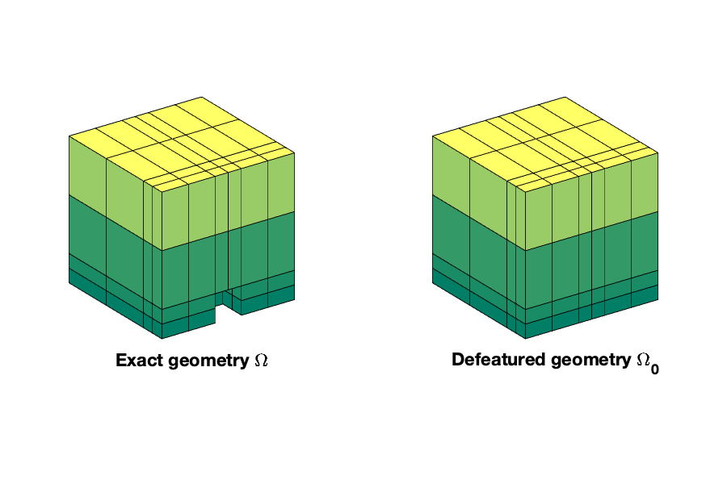

### **test31**:
* [BCV2022], Section 6.2.2 where $\Omega = \Omega^3_\varepsilon$
* 1 positive feature, 3D

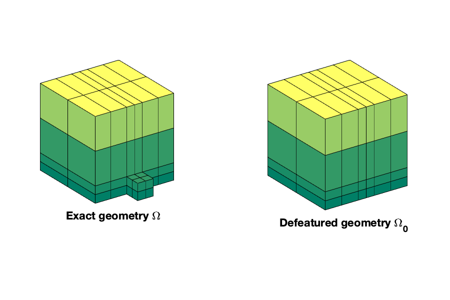

### **test32**:
* [BCV2022], Section 6.2.2 where $\Omega = \Omega^4_\varepsilon$
* 1 positive feature, 3D

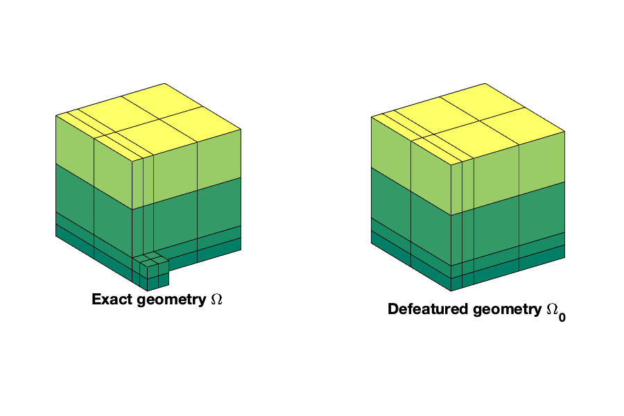

### **test35**:
* [BCV2022], Section 6.2.2 where $\Omega = \Omega^2_\varepsilon$
* 1 negative feature, 3D

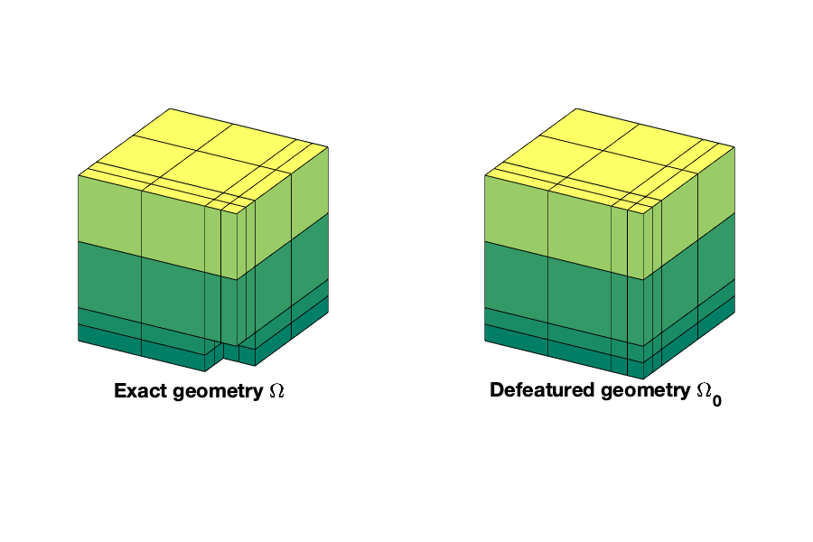
