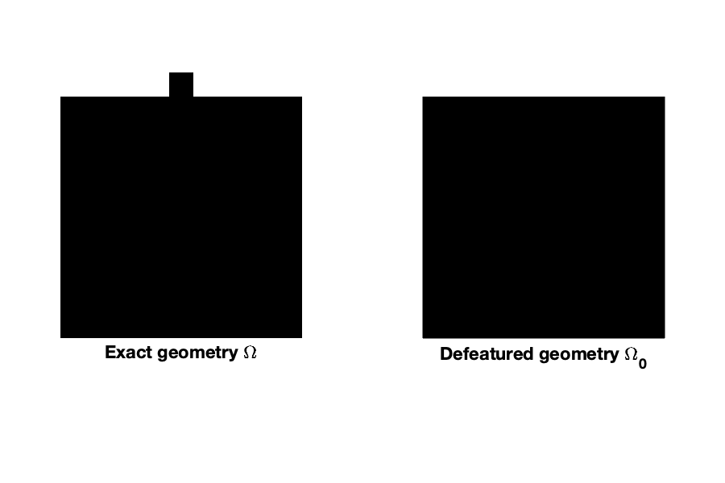
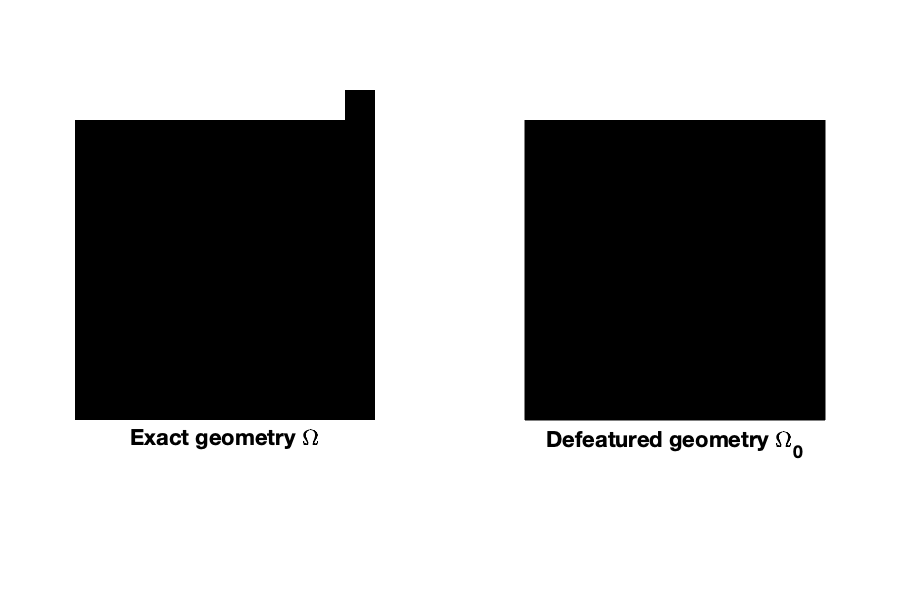
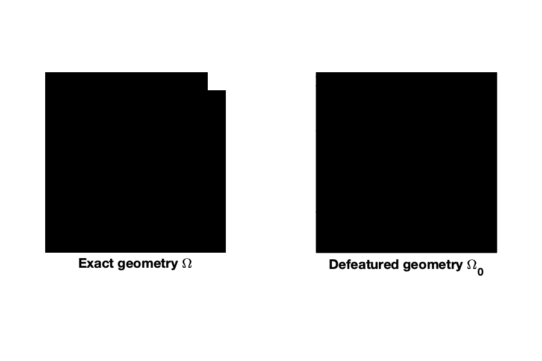

# Analysis-aware defeaturing

This repository contains the numerical illustrations published in the following papers:
  - "Analysis-aware defeaturing: Problem setting and _a posteriori_ estimation"\
    by Annalisa Buffa, Ondine Chanon and Rafael Vázquez\
    in _Mathematical Models and Methods in Applied Sciences_, 32(02), 359-402 (2022).\
    https://doi.org/10.1142/S0218202522500099/

Libraries needed to run the examples:
  - NURBS package: [https://octave.sourceforge.io/nurbs/](https://gnu-octave.github.io/packages/nurbs/)
  - GeoPDEs 3.2.2: [http://rafavzqz.github.io/geopdes/](http://rafavzqz.github.io/geopdes/)
  

### Tests and considered geometries:
The lines separate the different patches considered to represent the geometries. 

- **test01**: 1 positive feature, 2D

- **test02**: 1 positive feature, 2D

- **test04**: 1 negative feature, 2D

- **test05**: 1 negative feature, 2D

- **test16**: 1 negative feature, 2D

- **test17**: 1 negative feature, 2D

- **test18**: 1 negative feature, 2D

- **test19**: 1 negative feature, 2D

- **test21**: 1 positive feature, 2D

- **test30**: 1 negative feature, 3D

- **test31**: 1 positive feature, 3D

- **test32**: 1 positive feature, 3D

- **test35**: 1 negative feature, 3D

