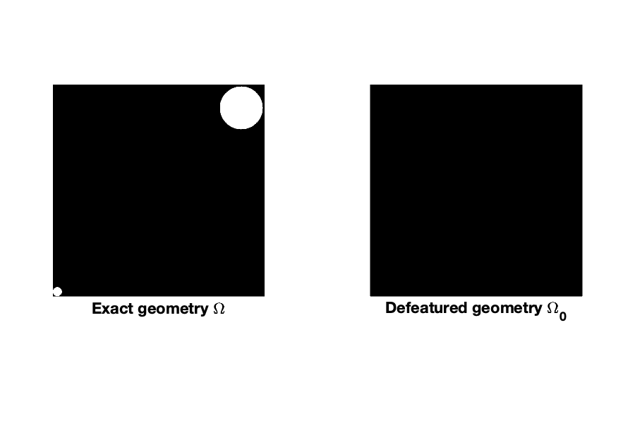

# Analysis-aware defeaturing

This repository contains most of the numerical illustrations presented in the following articles (and some more):
- [BCV2022] "Analysis-aware defeaturing: Problem setting and _a posteriori_ estimation"\
    &emsp;&emsp;&emsp;&emsp;&emsp;&nbsp;&nbsp;by Annalisa Buffa, Ondine Chanon and Rafael Vázquez\
    &emsp;&emsp;&emsp;&emsp;&emsp;&nbsp;&nbsp;in _Mathematical Models and Methods in Applied Sciences_, 32(02), 359-402 (2022).\
    &emsp;&emsp;&emsp;&emsp;&emsp;&nbsp;&nbsp;Journal article: [https://doi.org/10.1142/S0218202522500099](https://doi.org/10.1142/S0218202522500099)\
        &emsp;&emsp;&emsp;&emsp;&emsp;&nbsp;&nbsp;arXiv (Open Access): [https://doi.org/10.48550/arXiv.2007.11525](
https://doi.org/10.48550/arXiv.2007.11525)
- [AC2023+] "Analysis-aware defeaturing of complex geometries with Neumann features"\
    &emsp;&emsp;&emsp;&emsp;&emsp;&nbsp;&nbsp;by Pablo Antolín and Ondine Chanon\
    &emsp;&emsp;&emsp;&emsp;&emsp;&nbsp;&nbsp;in _International Journal for Numerical Methods in Engineering_, 125(3):e7380 (2024).\
    &emsp;&emsp;&emsp;&emsp;&emsp;&nbsp;&nbsp;Journal article (Open Access): [https://doi.org/10.1142/S0218202522500099](https://doi.org/10.1002/nme.7380)\
    &emsp;&emsp;&emsp;&emsp;&emsp;&nbsp;&nbsp;arXiv (Open Access): [https://doi.org/10.48550/arXiv.2212.03141](https://doi.org/10.48550/arXiv.2212.03141)

## Instructions to run the numerical examples

1. Install Matlab.
2. Add the following libraries to your Matlab path:
    - NURBS package: [https://octave.sourceforge.io/nurbs/](https://gnu-octave.github.io/packages/nurbs/)
    - GeoPDEs 3.2.2: [http://rafavzqz.github.io/geopdes/](http://rafavzqz.github.io/geopdes/)

### To run the examples in the `examples/multipatch/` folder:
3. Add to your Matlab path the folder `src/multipatch/` of this git repository.
4. Run the desired simulation from any subfolder of `examples/multipatch/`.

### To run the examples in the `examples/trimming/` folder:
3. An extension of the GeoPDEs library to handle trimmed geometries is needed [branch `defeaturing`], but the code is not yet public. Please contact the authors for more information.
4. Add to your Matlab path the folder `src/trimming/` of this git repository.
5. Run the desired simulation from any subfolder of `examples/trimming/`.

## Tests and considered geometries

### **test01**: 
* 1 positive feature, 2D.
* Convergence study of the defeaturing error and estimator with respect to the size of the feature.
* In `examples/multipatch/poisson/`.

### **test02**: 
* 1 positive feature, 2D.
* Convergence study of the defeaturing error and estimator with respect to the size of the feature.
    * [BCV2022], Section 6.2.1 where $\Omega = \Omega^4_\varepsilon$.
* In `examples/multipatch/poisson/`.

### **test03**: 
* 1 positive feature with different feature extensions, 2D. Case of a fillet.
* Study of the impact of the choice of the positive feature extension $\tilde F$ on the defeaturing error estimator.
    * [BCV2022], Section 6.3.2.
* In `examples/multipatch/poisson/`.

### **test04**: 
* 1 negative feature, 2D.
* Convergence study of the defeaturing error and estimator with respect to the size of the feature.
* In `examples/multipatch/poisson/`.

### **test05**:
* 1 negative feature, 2D.
* Convergence study of the defeaturing error and estimator with respect to the size of the feature.
    * [BCV2022], Section 6.2.1 where $\Omega = \Omega^2_\varepsilon$.
* In `examples/multipatch/poisson/`.

### **test06**:
* 1 complex feature (with a negative and a positive components), 2D
* Convergence study of the defeaturing error and estimator with respect to the size of the feature.
    * [BCV2022], Section 6.2.1 where $\Omega = \Omega^6_\varepsilon$.
* Test to prove that the features' separability condition is weak, in the context of a geometry with multiple features (see also **test07** and **test08**).
    * [AC2023+], Section 6.1.2 where $\Omega = \Omega_\delta$ for $\delta < 0$.
* In `examples/multipatch/poisson/`.

### **test07**:
* 1 complex feature (with a negative and a positive components), 2D.
* Convergence study of the defeaturing error and estimator with respect to the size of the feature.
    * [BCV2022], Section 6.2.1 where $\Omega = \Omega^5_\varepsilon$.
* Test to prove that the features' separability condition is weak, in the context of a geometry with multiple features (see also **test06** and **test08**).
    * [AC2023+], Section 6.1.2 where $\Omega = \Omega_\delta$ for $\delta = 0$.
* In `examples/multipatch/poisson/`.

### **test08**:
* 2 features (1 negative and 1 positive), 2D.
* Test to prove that the features' separability condition is weak, in the context of a geometry with multiple features (see also **test06** and **test07**).
    * [AC2023+], Section 6.1.2 where $\Omega = \Omega_\delta$ for $\delta > 0$.
* In `examples/multipatch/poisson/`.

### **test09**: 
* 1 positive feature with a feature extension, 2D.
* Convergence study of the defeaturing error and estimator with respect to the size of the feature.
* In `examples/multipatch/poisson/`.

### **test10**: 
* 1 negative feature, 2D. Case of a round.
* Study of a rounded angle for different values of the radius.
    * [BCV2022], Section 6.3.1 where $\Omega = \Omega_R$.
* In `examples/trimming/poisson/`.

### **test11**: 
* 2 negative features, 2D.
* Comparison between a small important feature and a large non-important feature. Here, _important_ means that the accuracy of the problem solution significantly decreases when the feature is removed from the computational domain. Or in other words, a feature is _important_ if the defeaturing error increases substantially when it is removed from the computational domain. 
    * [BCV2022], Section 6.1.2.
    * [AC2023+], Section 6.1.1.
* In `examples/trimming/poisson/`.

### **test12**: 
* 27 negative features, 2D.
* Study of the independence of the defeaturing error estimator with respect to the number of features. 
    * [AC2023+], Section 6.1.3.
* In `examples/trimming/poisson/`.

### **test13**: 
* 1 negative feature, 2D.
* Study of a geometry with one Neumann feature touching a Dirichlet boundary.
* In `examples/trimming/poisson/`.

### **test14**: 
* 1 negative feature, 2D.
* Convergence of the defeaturing error and estimator with respect to the distance between the feature and a Dirichlet boundary.
* In `examples/multipatch/poisson/`.

### **test15**: 
* 1 positive feature, 2D.
* Convergence study of the defeaturing error and estimator with respect to the size of the feature.
    * [BCV2022], Section 6.2.1 where $\Omega = \Omega^3_\varepsilon$.
* In `examples/multipatch/poisson/`.

### **test16**:
* 1 negative feature, 2D.
* Convergence study of the defeaturing error and estimator with respect to the size of the feature.
    * [BCV2022], Section 6.2.1 where $\Omega = \Omega^1_\varepsilon$
* In `examples/multipatch/poisson/`.

### **test17**:
* 1 negative feature, 2D.
* Study of the impact of the feature's shape on the defeaturing error estimator (see also **test18** and **test19**).
    * [BCV2022], Section 6.1.1 where $\Omega = \Omega_s$.
* In `examples/multipatch/poisson/`.

### **test18**: 
* 1 negative feature, 2D.
* Study of the impact of the feature's shape on the defeaturing error estimator (see also **test17** and **test19**).
    * [BCV2022], Section 6.1.1 where $\Omega = \Omega_c$.
* Study of the impact of the data of the defeatured problem (Neumann boundary condition and right hand side) on the convergence of the defeaturing error and estimator with respect to the size of the feature.
    * [BCV2022], Section 6.2.3 where $\Omega = \Omega_\varepsilon$.
* In `examples/multipatch/poisson/`.

### **test19**:
* 1 negative feature, 2D.
* Study of the impact of the feature's shape on the defeaturing error estimator (see also **test17** and **test18**).
    * [BCV2022] Section 6.1.1 where $\Omega = \Omega_\star$.
* In `examples/multipatch/poisson/`.

### **test30**: 
* 1 negative feature, 3D.
* Convergence study of the defeaturing error and estimator with respect to the size of the feature.
    * [BCV2022], Section 6.2.2 where $\Omega = \Omega^1_\varepsilon$.
* In `examples/multipatch/poisson/`.

### **test31**:
* 1 positive feature, 3D.
* Convergence study of the defeaturing error and estimator with respect to the size of the feature.
    * [BCV2022], Section 6.2.2 where $\Omega = \Omega^3_\varepsilon$.
* In `examples/multipatch/poisson/`.

### **test32**:
* 1 positive feature, 3D.
* Convergence study of the defeaturing error and estimator with respect to the size of the feature.
    * [BCV2022], Section 6.2.2 where $\Omega = \Omega^4_\varepsilon$.
* In `examples/multipatch/poisson/`.

### **test33**:
* 1 negative feature, 3D.
* Convergence study of the defeaturing error and estimator with respect to the size of the feature.
    * [BCV2022], Section 6.2.2 where $\Omega = \Omega^2_\varepsilon$.
* In `examples/multipatch/poisson/`.

